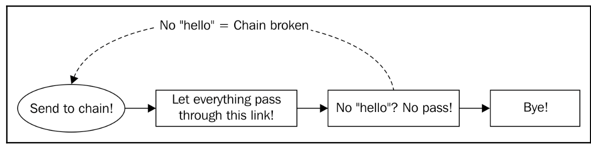

[Design Patterns](../../README.md) > [Behavioral Patterns](../README.md)

# Chain of Responsibility

The single responsibility principle implies that a type, function, method, or any similar abstraction must have one single responsibility only and it must do it quite well. This way, we can apply many functions that achieve one specific thing each to some struct, slice, map, and so on.

When we apply many of these abstractions in a logical way very often, we can chain them to execute in order such as, for example, a logging chain.

A logging chain is a set of types that logs the output of some program to more than one io.Writer interface. We could have a type that logs to the console, a type that logs to a file, and a type that logs to a remote server. You can make three calls every time you want to do some logging, but it's more elegant to make only one and provoke a chain reaction.

But also, we could have a chain of checks and, in case one of them fails, break the chain and return something. This is the authentication and authorization middleware works.

## Objectives
- Dynamically chain the actions at runtime based on some input
- Pass a request through a chain of processors until one of them can process it, in which case the chain could be stopped

 

# Example - A multi-logger chain

- Acceptance Criteria
    - We need a simple logger that logs the text of a request with a prefix First logger and passes it to the next link in the chain.
    - A second logger will write on the console if the incoming text has the word hello and pass the request to a third logger. But, if not, the chain will be broken and it will return immediately.
    - A third logger type is a general purpose logger called WriterLogger that uses an io.Writer interface to log.
    - A concrete implementation of the WriterLogger writes to a file and represents the third link in the chain.

# Summary
Chain of Responsibility Pattern is a powerful tool to achieve dynamic processing of actions and state handling. The Chain of responsibility pattern is widely used, also to create Finite State Machines (FSM). It is also used interchangeably with the Decorator pattern with the difference that when you decorate, you change the structure of an object while with the chain you define a behavior for each link in the chain that can break it too.