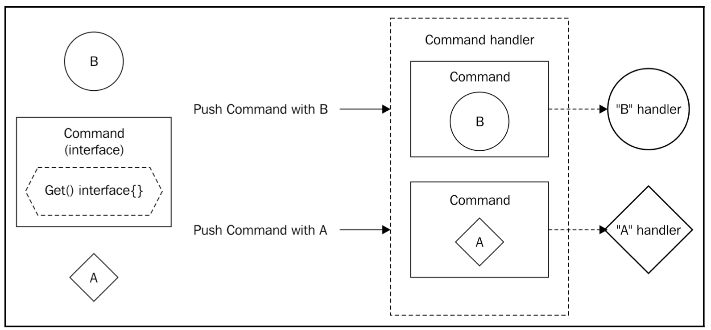

[Design Patterns](../../) > [Behavioral Patterns](../)

**"You need a way to connect types that are really unrelated? So design a Command for them"**

# Command
The `Command design pattern` is quite similar to the `Strategy design pattern` but with key differences. While in the strategy pattern we focus on changing algorithms, in the Command pattern, we `focus on the invocation of something or on the abstraction of some type`.

A Command pattern is commonly seen as a container. You put something like the info for user interaction on a UI that could be click on login and pass it as a command. You don't need to have the complexity related to the click on login action in the command but simply the action itself.
An example for the organic world would be a box for a delivery company. We can put anything on it but, as a delivery company, we are interested in managing the box instead of its contents directly.

The command pattern will be used heavily when dealing with channels. With channels you can send any message through it but, if we need a response from the receiving side of the channel, a common approach is to create a command that has a second, response channel attached where we are listening.

Similarly, a good example would be a multi-player video game, where every stroke of each user can be sent as commands to the rest of the users through the network.

## Objectives
When using the Command design pattern, we are trying to `encapsulate some sort of action or information in a light package that must be processed somewhere else`. It's similar to the Strategy pattern but, in fact, a Command could trigger a pre-configured Strategy somewhere else, so they are not the same. The following are the objectives for this design pattern:

- Put some information into a box. Just the receiver will open the box and know its contents
- Delegate some action somewhere else

The behavior is also explained in the following diagram:

`"We put the information in a box (the Command) and delegate what to do with it to the handlers of Commands."`

There we have a `Command` interface with a `Get()` interface{} method. We have a type `A` and a type `B`. The idea is that `A and B implement the Command interface` to return themselves as an ```interface{}```. As now they implement Command, they can be `used in a Command handler` which doesn't care very much about the underlying type. Now A and B can travel through functions that handles commands or store Commands freely. But B handler can take an object from any Command handler to "unwrap" it and take its B content as well as A command handler with its A content.


# Example - A simple queue

Our first example is going to be pretty small. We will put some information into a Command implementer and we will have a queue. We will create many instances of a type implementing a Command pattern and we will pass them to a queue that will store the commands until three of them are in the queue, at which time it will process them.

## Aceptance Criteria
So the ideal acceptance criteria to understand well the implications of the Command should reflect somehow the creation of a box that can accept unrelated types and the execution of the Command itself:
- We need a constructor of console printing commands. When using this constructor with a string, it will return a command that will print it. In this case, the handler is inside the command that acts as a box and as a handler.
- We need a data structure that stores incoming commands in a queue and prints them once the queue reaches the length of three.

<br>

# Strategy vs Command design pattern
Command is a very tiny design pattern; its functionality is quite easy to understand but it's widely used for its simplicity. It looks very similar to the Strategy pattern but remember that `Strategy is about having many algorithms to achieve some specific task`, but all of them achieve the same task. In the `Command pattern, you have many tasks to execute, and not all of them need to be equal`.
So, in short, the Command pattern is about execution encapsulation and delegation so that just the receiver or receivers trigger that execution.