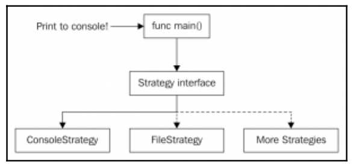
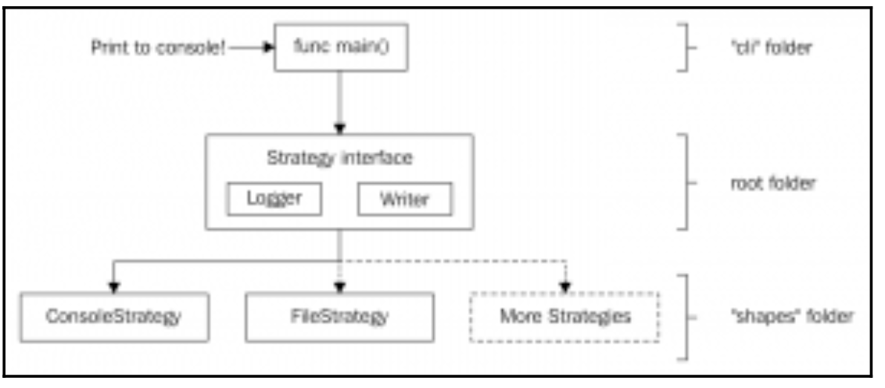

[Design Patterns](../../README.md) > [Behavioral Patterns](../README.md)

# Strategy Pattern
The Strategy pattern uses different algorithms to achieve some specific functionality. These algorithms are hidden behind an interface and, of course, they must be interchangeable. All algorithms achieve the same functionality in a different way. For example, we could have a Sort interface and few sorting algorithms. The result is the same, some list is sorted, but we could have used quick sort, merge sort, and so on

## Objectives
- Provide a few algorithms to achieve some specific functionality
- All types achieve the same functionality in a different way but the client of the strategy isn't affected

# Example - Rendering images or text

We are going to do something different for this example. Instead of printing text on the console only, we are also going to paint objects on a file.

In this case, we will have two strategies: console and file. But the user of the library won't have to deal with the complexity behind them.

The key feature is that the "caller" doesn ́t know how the underlying library is working and he just knows the information available on the defined strategy. This is nicely seen on the following diagram:



In this diagram, we have chosen to print to console but we won ́t deal with the ```ConsoleStrategy``` type directly, we ́ll always use an interface that represents it.
The ```ConsoleStrategy``` type will hide the implementation details of printing to console to caller in main function. ```FileStrategy``` hides its implementation details as well as any future strategy.

- Acceptance Criteria
    - Provide a way to show to the user an object (a square) in text or image
    - The user must choose between image or text when launching the app
    - The app must be able to add more visualization strategies (audio, for example)
    - If the user selects text, the word *Square* must be printed in the console
    - If the user selects image, an image of a white square on a black background will be printed on a file


## Run it!
### Console Strategy
````
make strategy-text
````
Should log ```Square``` to the console

### Image Strategy
````
make strategy-image
````
- Should create a red-square.jpg image like:


# Added Improvements

We added some improvements to our library to solve some issues:
- It cannot be used as a library. We have critical code written in the main package (strategy creation).(strategy creation).

    **Solution**: Abstract to two different packages the strategy creation from the command-line application.

<br>

- None of the strategies are doing any logging to file or console. We must provide a way to read some logs that an external user can integrate in their logging strategies or formats.

    **Solution**: Inject an io.Writer interface as dependency to act as a logging sink.

<br>

- Our ```TextSquare``` class is always writing to the console (an implementer of
the ```io.Writer``` interface) and the ```ImageSquare``` is always writing to file (another implementer of the io.Writer interface). This is **too coupled**.

    **Solution**: Inject an ```io.Writer``` interface so that the ```TextSquare``` and ```ImageSquare``` can write to any of the ```io.Writer``` implementations that are available (file and console, but also bytes buffer, binary encoders, JSON handlers... dozens of packages).
