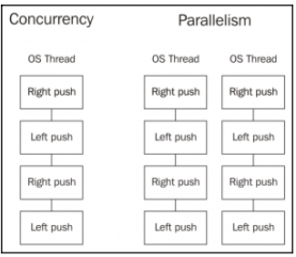
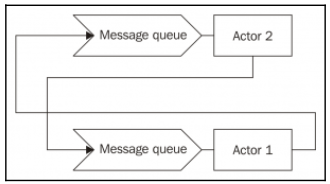

# Concurrency versus parallelism
"**Concurrency** is about dealing with many things at once. **Parallelism** is about doing many things at the same time"

 

**Concurrency** enables **Parallelism** by designing a correct structure of concurrency work

## The Tandem Bike example

We can think of the mechanism of a bike. When we pedal, we usually push down the pedal to produce force (and this push, raises our opposite leg on the opposite pedal). We cannot push with both legs at the same time because the cranks don't allow us to do it. But this design allows the construction of a parallel bike, commonly called a tandem bike. A tandem bike is a bike that two people can ride at the same time; they both pedal and apply force to the bike.

n the bike example, concurrency is the design of a bike that, with two legs (Goroutines), you can produce power to move the bike by yourself. The design is concurrent and correct. If we use a tandem bike and two people (two cores), the solution is concurrent, correct, and parallel. But the key thing is that with a concurrent design, we don't have to worry about parallelism; we can think about it as an extra feature if our concurrent design is correct. In fact, we can use the tandem bike with only one person, but the concurrent design of the legs, pedals, chain, wheels of a bike is still correct.

With concurrency, on the left side, we have a design and a structure that is executed sequentially by the same CPU core. Once we have this design and structure, parallelism can be achieved by simply repeating this structure on a different thread.

This is how Go eases the reasoning about concurrent and parallel programs by simply not worrying too much about parallel execution and focusing much more on concurrent design and structure. Breaking a big task into smaller tasks that can be run concurrently usually provides much better performance in a single-core computer, but, if this design can also be run in parallel, we could achieve an even higher throughput (or not, depending on the design).

In fact, we can set the number of cores in use in a Go app by setting the environment variable `GOMAXPROCS` to the number of cores we want. This is not only useful when using schedulers, such as `Apache Mesos`, but it gives us more control about how a Go app works and performs.

So, to recap, it is very important to keep in mind that **concurrency is about structure** and **parallelism is about execution**. We must think about making our programs concurrent in a better way, by breaking them down into smaller pieces of work, and **Go's scheduler** will try to make them parallel if it's possible and allowed.

# CSP versus actor-based concurrency
## Actor Model
The most common and, perhaps, intuitive way to think about concurrency is close to the way the actor model works.

In the actor model, if **Actor 1** wants to communicate with **Actor 2**, then **Actor 1** must know **Actor 2** first; for example, it must have its process ID, maybe from the creation step, and put a message on its **inbox queue**. After placing the message, **Actor 1** can continue its tasks without getting blocked if **Actor 2** cannot process the message immediately.

## CSP - Communicating Sequential Processes (used by Golang)

**CSP**, on the other side, introduces a new entity into the equation - **channels**.
**Channels** are the way to communicate between processes because they are **completely anonymous** (unlike actors, where we need to know their process IDs). In the case of CSP, we don't have a process ID to use to communicate. Instead, we have to create a channel to the processes to **allow incoming and outgoing communication**. In this case, what we know that the receiver is the channel it uses to receive data:

In this diagram, we can see that the processes are anonymous, but we have a channel with ID 1, that is, Channel 1, which connects them together. This abstraction does not tell us how many processes are on each side of the channel; it simply connects them and allows communication between processes by using the channel.

The key here is that channels isolate both extremes so that process A can send data through a channel that will be handled by potentially one or more processes that' are transparent to A. It also works the same in reverse; process B can receive data from many channels one at a time.

# Key Concepts
- [Goroutines](./goroutine/)
- [WaitGroups](./waitgroup/)
- [Callbacks](./callbaks/)
- [Mutex & race detector flag](./mutex/)
- [Channels](./channels/)
- [Buffered Channels](./buffered-channels/)
- [Directional Channels](./directional-channels/)
- [Select statement](./select-statement/)
- [Using range in channel](./range/)

**Concurrency Example**: [Channel Singleton](./channel-singleton/)

