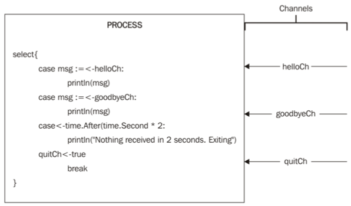

# The select statement
It is used to **handle more than one channel input within a Goroutine**




In the `select` structure, we ask the program to choose between **one or more channels to receive their data**. We can save this data in a variable and make something with it before finishing the select. **The select structure is just executed once**; it doesn't matter if it is listening to more channels, it will be executed only once and the code will continue executing. If we want it to handle the same channels more than once, we have to put it in a for loop.

# Run example
```make select-statement```