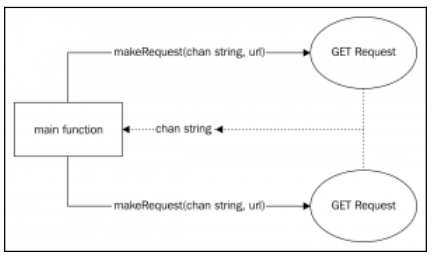

[Design Patterns](../../README.md) > [Concurrency Patterns](../README.md)

Very common pattern, especially when we have to wait for more than one response from differente Goroutines before letting the program continue

# Barrier

Imagine the situation where we have a microservices application where one service needs to compose its response by merging the responses of another three microservices. This is where the Barrier pattern can help us.

Our Barrier pattern could be a service that will block its response until it has been composed with the results returned by one or more different Goroutines (or services). And what kind of primitive do we have that has a blocking nature? Well, we can use a lock, but it's more idiomatic in Go to use an unbuffered channel

## Objectives
- Compose the value of a type with the data coming from one or more Goroutines
- Control the correctness of any of those incoming data pipes so that no inconsistent data is returned. We don't want a partially filled result because one of the pipes has returned an error

# Example - HTTP GET Aggregator
Typical situation in a microservices application - an app that performs two HTTP GET calls and joins them in a single response that will be printed on the console.

Each request must be performed in a different Goroutine and print the result on console if both responses are correct. If any of them returns an error, then we print just the error.

## Acceptance Criteria
- Print on the console the merged result of the two calls to `http://httpbin.org/headers` and `http://httpbin.org/User-Agent` URLs. These are a couple of public endpoints that respond with data from the incoming connections. They are very popular for testing purposes. You will need an internet connection to do this exercise.
- If any of the calls fails, it must not print any result-just the error message (or error messages if both calls failed).
- The output must be printed as a composed result when both calls have finished. It means that we cannot print the result of one call and then the other.

# Waiting for responses with the Barrier design pattern
The Barrier pattern opens the door of microservices programming with its composable nature. It could be considered a Structural pattern, as you can imagine

The Barrier pattern is not only useful to make network requests; we could also use it to split some task into multiple Goroutines. For example, an expensive operation could be split into a few smaller operations distributed in different Goroutines to maximize parallelism and achieve better performance.