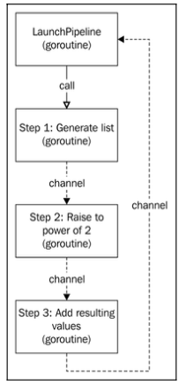

[Design Patterns](../../README.md) > [Concurrency Patterns](../README.md)

Powerful pattern to build complex synchronous flows of Goroutines that are connected with each other according to some logic

You will use this pattern heavily in your concurrent structures, and we can consider it one of the most useful too.
#  Pipeline
We already know what a pipeline is. Every time that we write any function that performs some logic, we are writing a pipeline: If this then that, or else something else.

Pipelines pattern can be made more complex by using a few functions that call to each other. They can even get looped in their out execution.

The Pipeline pattern in Go works in a similar fashion, but each step in the Pipeline will be in a different Goroutine and communication, and synchronizing will be done using channels.

## Objectives
- We can create a concurrent structure of a multistep algorithm
- We can exploit the parallelism of multicore machines by decomposing an algorithm in different Goroutines

**However**, just because we decompose an algorithm in different Goroutines doesn't necessarily mean that it will execute the fastest. We are constantly talking about CPUs, so ideally the algorithm must be CPU-intensive to take advantage of a concurrent structure. The overhead of creating Goroutines and channels could make an algorithm smaller.

 # Example - A concurrent multi-operation
We are going to generate a list of numbers starting with 1 and ending at some arbitrary number N. Then we will take each number, power it to 2, and sum the resulting numbers to a unique result. So, if N=3, our list will be [1,2,3]. After powering them to 2, our list becomes [1,4,9]. If we sum the resulting list, the resulting value is 14.



Each step in this pipeline pattern will have the following structure (**except the first step**)
````
func functionName(in <-chan int) (<-chan int){
     out := make(chan bool, 100)

     go func(){
       for v := range in {
            // Do something with v and send it to channel out
        }
        close(out)
    }()

    return out
}
````

## Acceptance Criteria
1. Generate a list from 1 to N where N can be any integer number
2. Take each number of this generated list and raise it to the power of 2
3. Sum each resulting number into a final result and return it


# Final words on the Pipeline pattern
With the Pipeline pattern, we can create really complex concurrent workflows in a very easy way. In our case, we created a linear workflow, but it could also have conditionals, pools, and fan-in and fan-out behavior