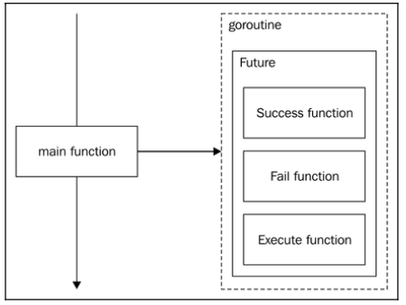

[Design Patterns](../../README.md) > [Concurrency Patterns](../README.md)

Allows us to write an algorithm that will be executed eventually in time (or not) by the same Goroutine or a different one

#  Promise / Future
we will define each possible behavior of an action before executing them in different Goroutines. Node.js uses this approach, providing event-driven programming by default.

The idea here is to achieve a fire-and-forget that handles all possible results in an action.
To understand it better, we can talk about a type that has embedded the behavior in case an execution goes well or in case it fails.

In the preceding diagram, the main function launches a Future within a new Goroutine. It won't wait for anything, nor will it receive any progress of the Future. It really **fires and forgets it**.

The interesting thing here is that **we can launch a new Future within a Future and embed as many Futures** as we want in the same Goroutine (or new ones). The idea is to take advantage of the result of one Future to launch the next.

## Objectives
 - Delegate the action handler to a different Goroutine
 - Stack many asynchronous calls between them (an asynchronous call that calls another asynchronous call in its results)

 # Example - Asynchronous Requester
We will have a method that returns a string or an error, but we want to execute it concurrently. We have learned ways to do this already. Using a channel, we can launch a new Goroutine and handle the incoming result from the channel.

But in this case, we will have to handle the result (string or error), and we don't want this. Instead, **we will define what to do in case of success and what to do in case of error and fire- and-forget the Goroutine**.

## Acceptance Criteria
- Delegate the function execution to a different Goroutine
- The function will return a string (maybe) or an error
- The handlers must be already defined before executing the function
- The design must be reusable

# Putting the Future/Promise together
We have seen a good way to achieve asynchronous programming by using a function type system.

However, notice that we could also have done it without functions by setting an interface with Success, Fail, and Execute methods and the types that satisfy them, and using the Template pattern to execute them asynchronously.