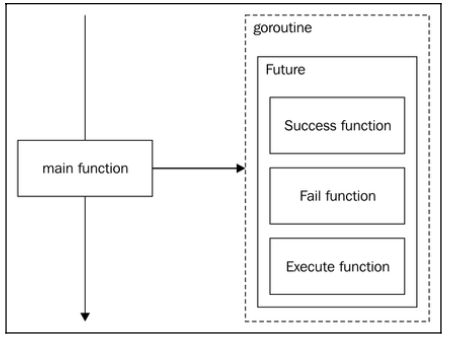

[Design Patterns](../../README.md) > [Concurrency Patterns](../README.md)

**"Observer pattern with concurrency"**

#  Publish/Subscriber
The Observer pattern maintains a list of observers or subscribers that want to be notified of a particular event. In this case, each subscriber is going to run in a different Goroutine as well as the publisher. We will have new problems with building this structure:
- Now, the access to the list of subscribers must be serialized. If we are reading the list with one Goroutine, we cannot be removing a subscriber from it or we will have a race condition
- When a subscriber is removed, the subscriber's Goroutine must be closed too, or it will keep iterating forever and we will run into Goroutine leaks
- When stopping the publisher, all subscribers must stop their Goroutines, too.

<!--  -->

## Objectives
The objectives of this publish/subscriber are the same as in the Observer pattern, the difference here is the way we will develop it. The idea is to make a concurrent structure to achieve the same functionality, which is as follows:

- Providing an event-driven architecture where one event can trigger one or more actions
- Uncoupling the actions that are performed from the event that triggers them
- Providing more than one source event that triggers the same action

The idea is to uncouple senders from receivers, hiding from the sender the identity of the receivers that will process its event, and hiding the receivers from the number of senders that can communicate with them.

In particular, if I develop a click in a button in some application, it could do something (such as log us in somewhere). Weeks later, we might decide to make it show a popup, too. If, every time we want to add some functionality to this button, we have to change the code where it handles the click action, that function will become huge and not very portable to other projects. If we use a publisher and one observer for every action, the click function only needs to publish one single event using a publisher, and we will just write subscribers to this event every time we want to improve the functionality. This is especially important in applications with user interfaces where many things to do in a single UI action can slow the responsiveness of an interface, completely destroying the user experience.


# Example - A concurrent notifier
This particular notifier will work by passing around interface{} values, like in the workers pool example. This way, we can use it for more than a single type by introducing some overhead when casting on the receiver.
We will work with two interfaces.
## Subscriber
````
type Subscriber interface {
    Notify(interface{}) error
    Close()
}
````
## Publisher
````
type Publisher interface {
    start()
    AddSubscriberCh() chan<- Subscriber
    RemoveSubscriberCh() chan<- Subscriber
    PublishingCh() chan<- interface{}
    Stop()
}
````

## Acceptance Criteria
1. We must have a publisher with a PublishingCh method that returns a channel to send messages through and triggers a Notify method on every observer subscribed.
2. We must have a method to add new subscribers to the publisher.
3. We must have a method to remove new subscribers from the publisher.
4. We must have a method to stop a subscriber.
5. We must have a method to stop a Publisher interface that will also stop all subscribers.
6. All inter Goroutine communication must be synchronized so that no Goroutine is locked waiting for a response. In such cases, an error is returned after the specified timeout period has passed.

